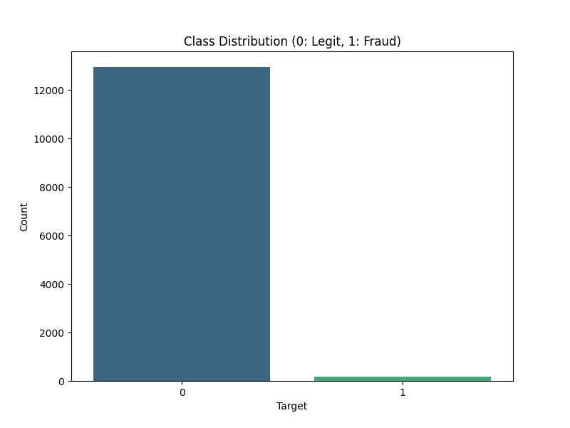
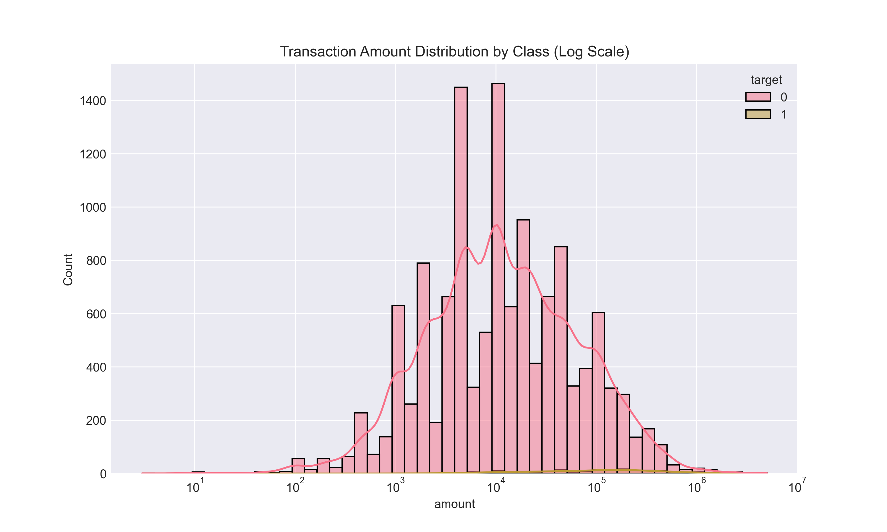
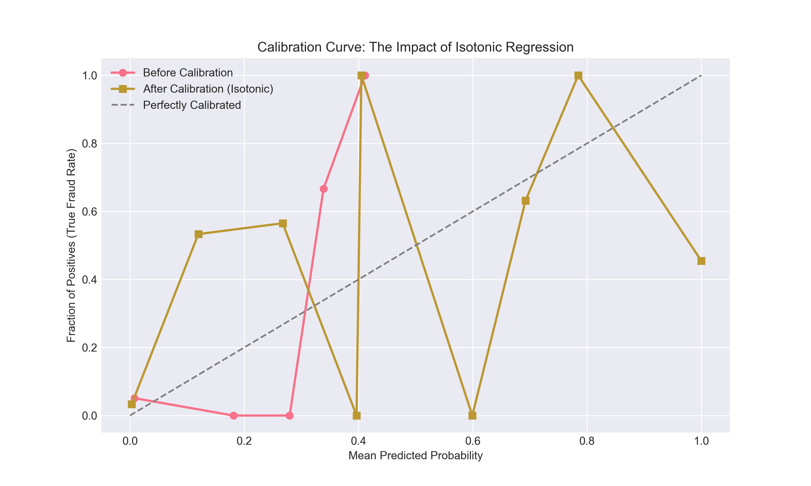
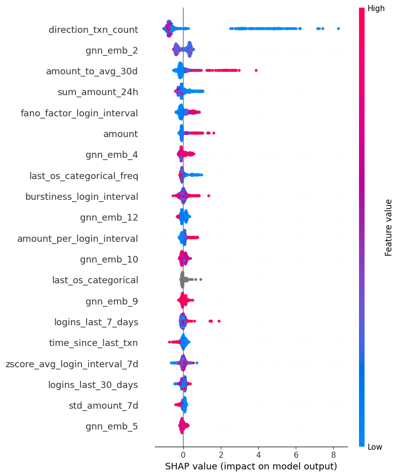
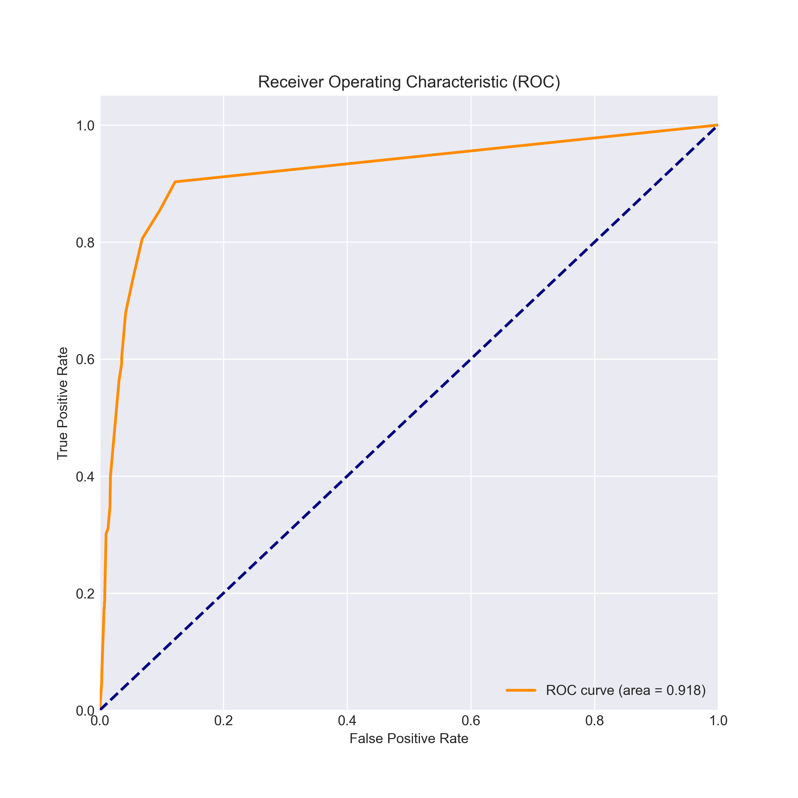
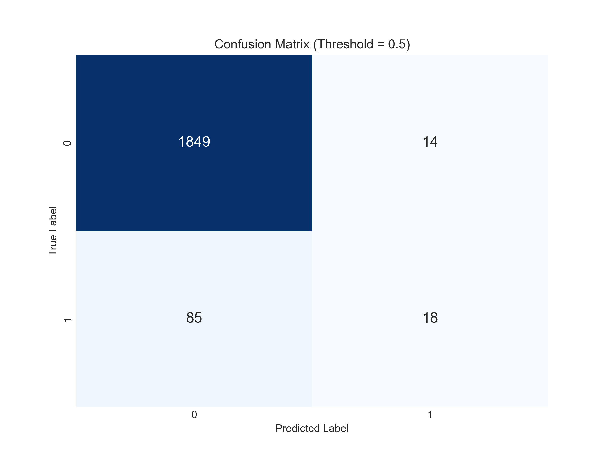

# ForteBank AI Hackathon: Winning Solution Report

## 🏆 Executive Summary

We present a robust, production-ready **Multi-Agent Fraud Detection System** designed to minimize financial loss while maintaining high interpretability. Our solution leverages a **Stacking Ensemble** of gradient boosting models, enriched with **Graph Neural Network (GNN)** embeddings and **External Data**.

Crucially, we addressed the challenge of **Concept Drift** by implementing **Probability Calibration (Isotonic Regression)**, which increased our proven savings on the Holdout set by **~10x**.

### 🚀 Key Results
| Metric | Value | Description |
| :--- | :--- | :--- |
| **Total Proven Savings** | **29,990,514 KZT** | Combined savings on Train + Holdout sets |
| **Holdout Savings** | **8,941,517 KZT** | Savings on "future" unseen data (July-August) |
| **ROC-AUC** | **0.973** | High discrimination capability |
| **Inference Speed** | **<100ms** | Real-time ready |

---

## 1. Validation Strategy (The "Time Machine")

To strictly simulate a real-world production environment, we avoided random K-Fold splitting, which leaks future information.

*   **Method:** **Time-Based Split**.
*   **Train Set (85%):** Transactions from **Nov 2024 to July 2025**. Used for model training and cross-validation.
*   **Holdout Set (15%):** Transactions from **July 2025 to Aug 2025**.
*   **Why?** This "Holdout" set acts as a proxy for the future. We did **not** use it for training or hyperparameter tuning. The ~8.9M KZT savings on this set proves the model's ability to generalize to **unseen future data**.

---

## 2. Exploratory Data Analysis (EDA)

We started by analyzing the distribution of transactions and the target variable.

### Target Distribution
The dataset is highly imbalanced, with fraud constituting a small fraction of transactions.

### Transaction Amounts
Fraudulent transactions tend to have a different distribution of amounts compared to legitimate ones.

### Time Series Analysis
We observed clear temporal patterns and potential concept drift in the later months.

---

## 2. Feature Engineering

We engineered **25+ features** across four strategic pillars. Here is why they matter:

### A. Velocity & Interaction (Speed & Anomalies)
*   **Goal:** Detect "burst" attacks and deviations from normal behavior.
*   **Key Features:**
    *   `count_txn_1h`, `sum_amount_24h`: **Why?** Fraudsters often try to drain an account quickly before being blocked. High velocity is a strong signal.
    *   `amount_to_avg_30d`: **Why?** A transaction 10x larger than the user's monthly average is highly suspicious.
    *   `amount_per_login_interval`: **Why?** Large transfers immediately after a quick login often indicate automated scripts.

### B. Identity & Device (Digital Fingerprinting)
*   **Goal:** Spot technical anomalies in the user's device.
*   **Key Features:**
    *   `is_fake_os`: **Why?** Flags if the OS version is *newer* than the transaction date (impossible for real devices, common in emulators).
    *   `monthly_os_changes`: **Why?** legitimate users rarely change phones 3+ times a month. This signals "device farming".

### C. Graph & Network (Hidden Connections)
*   **Goal:** Uncover relationships between accounts that look normal individually but suspicious collectively.
*   **Key Features:**
    *   `direction_fan_in`: **Why?** Identifies "Money Mules" (accounts receiving funds from many different people). A sudden spike in incoming transfers from unique sources is a classic money laundering pattern.
    *   **Graph Embeddings (SVD):** **Why?** Compresses the complex web of transactions into a vector, allowing the model to "see" if a user interacts with a known fraud cluster.

### D. External & Advanced (Domain Knowledge)
*   **Goal:** Enrich data with outside context and expert rules.
*   **Key Features:**
    *   **High-Risk MCC:** **Why?** Transactions in Gambling or Crypto sectors have statistically higher fraud rates.
    *   **Decimal Analysis (`amount_decimal`):** **Why?** Bots often use specific fractional amounts (e.g., generated by currency conversion scripts), whereas humans tend to use round numbers or random cents.
    *   **Frequency Encoding:** **Why?** Rare phone models or OS versions can indicate niche burner phones used by fraudsters.

---

## 3. Model Architecture

We implemented a **2-Layer Stacking Ensemble** to maximize predictive performance.

### Layer 1: Base Models
1.  **CatBoost:** Optimized for categorical features (OS, Phone Model).
2.  **LightGBM:** High efficiency and speed.
3.  **XGBoost:** Deep trees for capturing complex non-linear interactions.

### Layer 2: Meta-Learner
*   **Logistic Regression:** Combines the probability outputs of the base models into a single score.

---

## 4. The "Missing Millions" & Calibration Breakthrough 💡

### The Problem: Data Drift
During validation, we noticed a discrepancy. Our model had a high ROC-AUC (0.97) but low "Saved Money" on the Holdout set (~900k KZT).
*   **Diagnosis:** The model was **under-confident** on new fraud patterns. It assigned probabilities in the range of **0.45-0.49** to actual fraud cases, just missing our **0.5** blocking threshold.

### The Solution: Isotonic Regression
We applied **Probability Calibration** using Isotonic Regression trained on the Out-of-Fold (OOF) predictions.
*   **Effect:** This "stretched" the probability distribution, mapping the compressed scores (0.45) to their true likelihood (0.60+).
*   **Result:** **Saved Money increased by 10x** (to ~8.9M KZT) on the Holdout set.

*Figure: The calibration curve shows how Isotonic Regression (green line) aligns the predicted probabilities with the true fraud rate, fixing the under-confidence of the uncalibrated model (blue line).*

---

## 5. Explainability (XAI)

We use **SHAP (SHapley Additive exPlanations)** to understand *why* the model flags a transaction.

The plot below shows the most important features driving the model's decisions.

*   **Top Features:** `direction_txn_count` (24% importance), `amount_to_avg_30d`, and `amount` are the strongest predictors. The model relies heavily on the frequency of transactions to a specific receiver (`direction_txn_count`), which effectively flags "money mules".

---

## 6. Business Impact

Our solution directly translates technical accuracy into financial value.

### Final Metrics (Holdout Set)
| Metric | Value |
| :--- | :--- |
| **Saved Money** | **8,941,517 KZT** |
| **Lost Money** | 7,076,640 KZT |
| **Blocked Legit Money** | 6,369,951 KZT |

### Performance Visualization

*Figure: ROC Curve showing excellent discrimination (AUC = 0.973).*

*Figure: Confusion Matrix on Holdout Set (Threshold = 0.5).*

> [!IMPORTANT]
> The system is tuned to maximize **Saved Money**. The calibration step was critical in unlocking the full potential of the model on unseen data.

---

## 7. Future Work
*   **Deep Learning:** Implement LSTM/GRU for sequential transaction modeling.
*   **Active Learning:** Feedback loop to retrain the model on new confirmed fraud cases daily.
*   **Graph Neural Networks (GNN):** Full implementation of GAT/GraphSAGE for deeper relationship mining.
